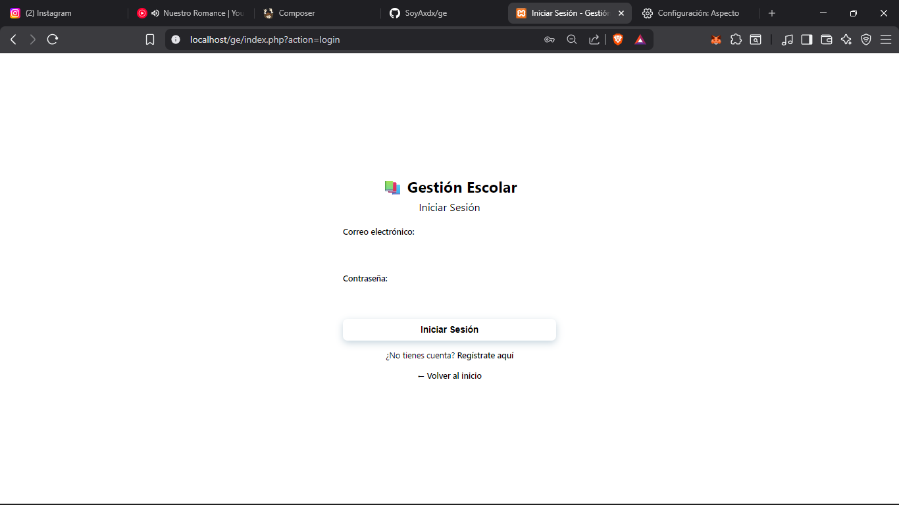
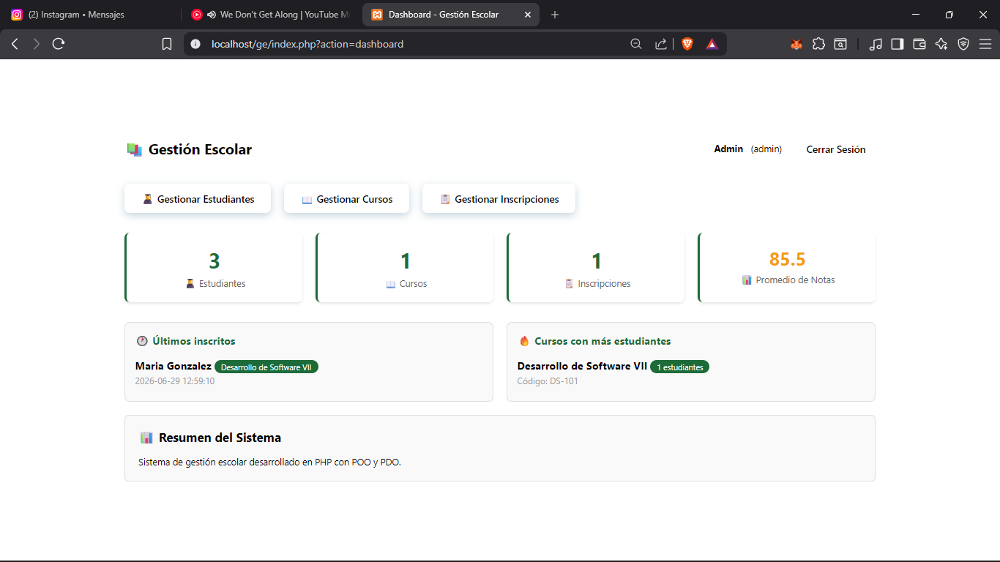
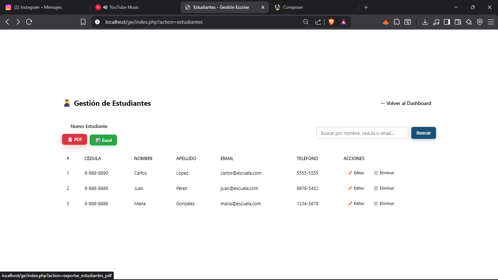
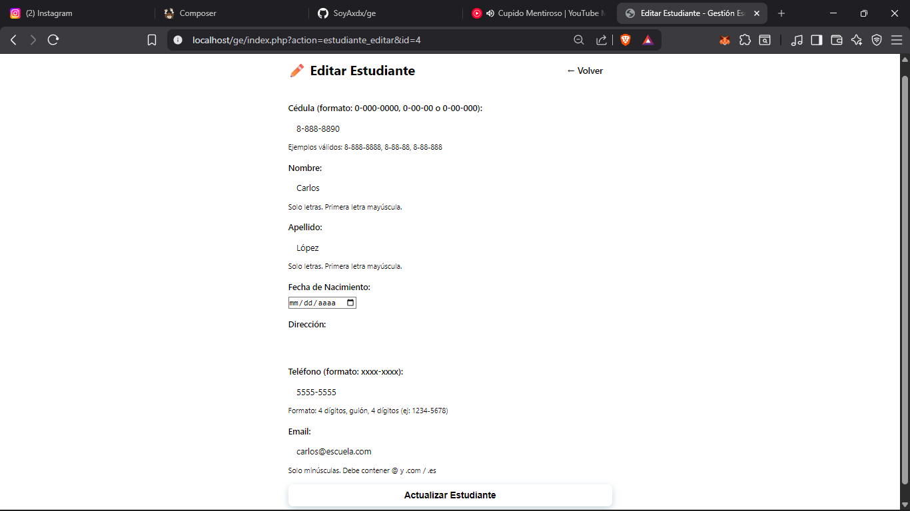
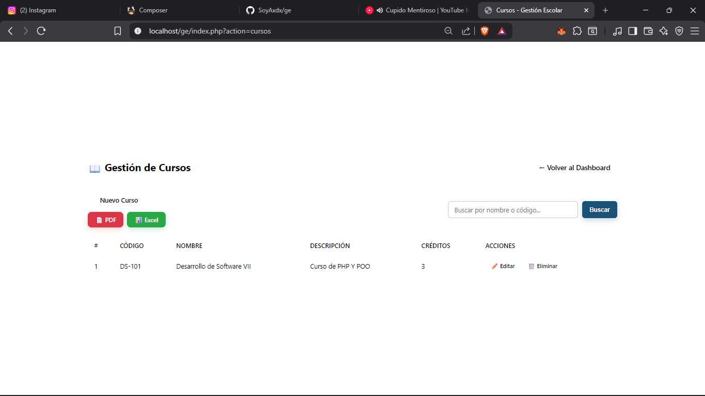
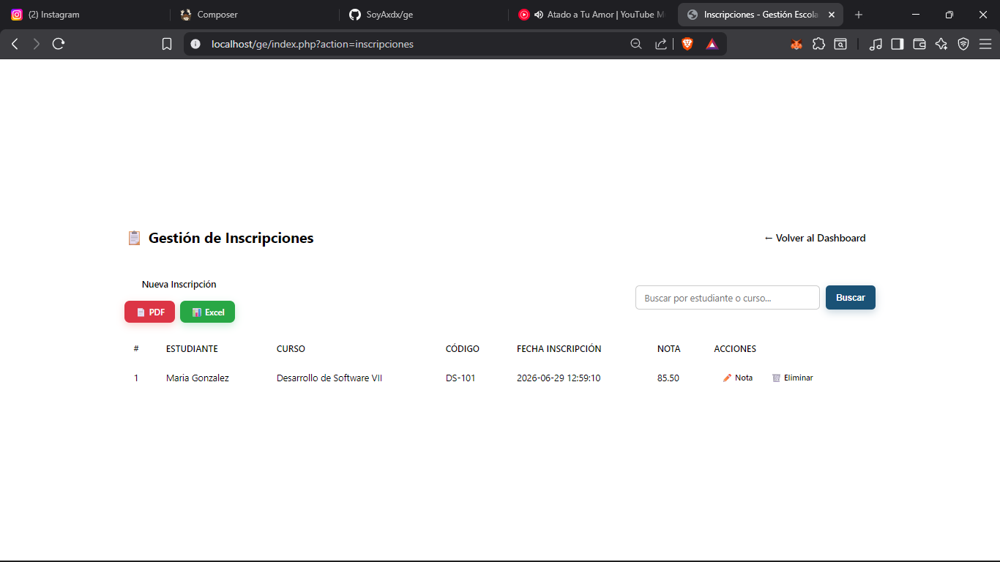
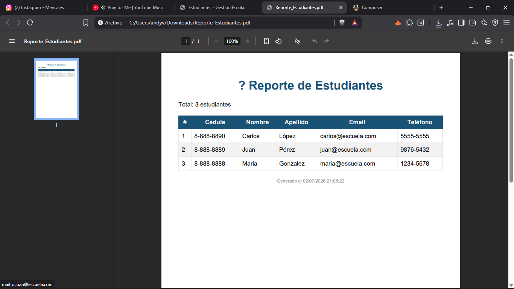

# 📚 Gestión Escolar (GE)


Sistema de gestión escolar desarrollado en **PHP** con programación orientada a objetos (POO), arquitectura **MVC** y conexión a base de datos con **PDO**.

---

## 📸 Capturas de pantalla

### Login


### Dashboard


### Gestión de Estudiantes


### Formulario de Estudiante


### Gestión de Cursos


### Gestión de Inscripciones


### Exportación a PDF


---

## 🚀 Tecnologías utilizadas

- **PHP 8.x** (POO, PDO)
- **MySQL** (MariaDB)
- **HTML5, CSS3, JavaScript**
- **XAMPP** (Apache + MySQL)
- **Visual Studio Code**
- **Composer** (gestión de dependencias)
- **dompdf** (generación de PDF)
- **PhpSpreadsheet** (generación de Excel)

---

## 📁 Estructura del proyecto

```
ge/
├── assets/
│   ├── css/
│   │   └── style.css
│   ├── img/
│   │   └── favicon.ico
│   ├── js/
│   │   └── main.js
│   └── screenshots/
│       ├── cursos.png
│       ├── dashboard.png
│       ├── estudiantes-form.png
│       ├── estudiantes.png
│       ├── export-pdf.png
│       ├── inscripciones.png
│       └── login.png
├── config/
│   └── Database.php
├── controllers/
│   ├── AuthController.php
│   ├── CursoController.php
│   ├── DashboardController.php
│   ├── EstudianteController.php
│   └── InscripcionController.php
├── models/
│   ├── Curso.php
│   ├── Estudiante.php
│   ├── Inscripcion.php
│   └── Usuario.php
├── views/
│   ├── auth/
│   │   ├── login.php
│   │   └── register.php
│   ├── cursos/
│   │   ├── crear.php
│   │   ├── editar.php
│   │   ├── eliminar.php
│   │   └── index.php
│   ├── errors/
│   │   ├── 403.php
│   │   ├── 404.php
│   │   └── 500.php
│   ├── estudiantes/
│   │   ├── crear.php
│   │   ├── editar.php
│   │   ├── eliminar.php
│   │   └── index.php
│   ├── inscripciones/
│   │   ├── crear.php
│   │   ├── editar.php
│   │   └── index.php
│   ├── layout/
│   │   ├── footer.php
│   │   └── header.php
│   └── dashboard.php
├── helpers/
│   ├── env.php
│   ├── exportar.php
│   └── functions.php
├── vendor/
│   └── (dependencias de Composer)
├── .env.example
├── .gitignore
├── .htaccess
├── composer.json
├── composer.lock
├── composer.phar
├── index.php
├── LICENSE
├── README.md
└── test_error.php
```

---

## 🔧 Instalación y configuración

### 1. Clonar el repositorio
```bash
git clone https://github.com/SoyAxdx/ge.git
```

### 2. Mover a la carpeta de XAMPP
```bash
mv ge/ C:\xampp\htdocs\
```

### 3. Configurar variables de entorno
```bash
cp .env.example .env
# Edita .env con tus credenciales de base de datos
```

### 4. Instalar dependencias con Composer
```bash
composer install
```

### 5. Crear la base de datos
- Abre **phpMyAdmin**: `http://localhost/phpmyadmin`
- Importa el archivo `ge.sql` (está en la raíz del proyecto) o ejecuta el script SQL manualmente.

### 6. Ejecutar el proyecto
- Asegúrate de que **Apache** y **MySQL** estén activos en XAMPP.
- Abre tu navegador en: `http://localhost/ge/index.php?action=login`

---

## 🔐 Usuario administrador por defecto

| Campo | Valor |
|-------|-------|
| **Email** | `admin@escuela.com` |
| **Contraseña** | `admin123` |

---

## 🧪 Datos de prueba

El sistema incluye datos de prueba para facilitar las pruebas:

- **Estudiantes:** María González, Juan Pérez, Carlos López
- **Cursos:** Desarrollo de Software VII (DS-101)
- **Inscripción:** María González → DS-101 con nota 85.50

---

## ✅ Funcionalidades implementadas

### 📋 CRUD Completo
| Módulo | Descripción |
|--------|-------------|
| **Autenticación** | Login, registro con roles (admin, docente, estudiante) |
| **Dashboard** | Estadísticas generales (estudiantes, cursos, inscripciones, promedio de notas) |
| **Estudiantes** | CRUD completo con validaciones (cédula, nombre, apellido, email, teléfono) |
| **Cursos** | CRUD completo con código, nombre, descripción, créditos |
| **Inscripciones** | Asignación de estudiantes a cursos, gestión de notas |

### 🔍 Buscadores
- **Estudiantes:** Búsqueda por nombre, apellido, cédula o email.
- **Cursos:** Búsqueda por nombre o código.
- **Inscripciones:** Búsqueda por estudiante o curso.

### 📊 Exportación de datos
El sistema permite exportar los datos de cada módulo en dos formatos:

| Módulo | PDF | Excel |
|--------|-----|-------|
| **Estudiantes** | ✅ | ✅ |
| **Cursos** | ✅ | ✅ |
| **Inscripciones** | ✅ | ✅ |

**Comandos utilizados para la exportación:**
```bash
# Instalar dompdf para PDF
composer require dompdf/dompdf

# Instalar PhpSpreadsheet para Excel
composer require phpoffice/phpspreadsheet
```

**Ejemplo de uso:**
```php
// Exportar estudiantes a PDF
public function exportarPDF() {
    $estudiantes = $this->modelo->obtenerTodos();
    // ... generar HTML con los datos
    exportarPDF($html, 'Reporte_Estudiantes');
}

// Exportar estudiantes a Excel
public function exportarExcel() {
    $estudiantes = $this->modelo->obtenerTodos();
    // ... preparar datos
    exportarExcel($datos, $columnas, 'Reporte_Estudiantes');
}
```

### 🛡️ Seguridad
- Contraseñas hasheadas con `password_hash()`
- Consultas preparadas con PDO (prevención de SQL Injection)
- Validaciones en cliente y servidor
- Restricciones `UNIQUE` en base de datos (cédula, teléfono, email)
- **Protección CSRF** en todos los formularios
- **Variables de entorno (`.env`)** para configuración sensible
- **Páginas de error personalizadas:** 404, 403, 500
- **Modo oscuro:** Toggle manual y automático según preferencia del sistema

### 🎨 Mejoras visuales
- Diseño moderno y responsive
- Barra lateral de navegación
- Tarjetas de estadísticas en el Dashboard
- Modo oscuro/claro
- Iconos de Bootstrap

---

## 📌 Próximas mejoras

- [ ] Gráficos en el Dashboard
- [ ] Módulo de notas por curso
- [ ] Envío de correos electrónicos
- [ ] API REST para servicios externos
- [ ] Sistema de roles más granular

---

## 👨‍💻 Autor

**Andy Pitterson** – [GitHub](https://github.com/SoyAxdx)

---

## 📄 Licencia

Este proyecto es de uso académico para la asignatura **Desarrollo de Software VII** – Universidad Tecnológica de Panamá, Centro Regional de Bocas del Toro.